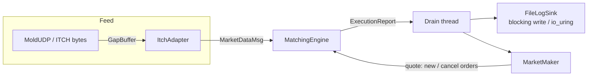

# tick-to-trade

[](https://github.com/nisgemML/tick-to-trade/actions/workflows/ci.yml)

**Integrated low-latency trading stack.** Four independently-deep repos
composed into one measurable, failure-aware pipeline, plus a real
inventory-aware market maker consuming its own fills — not four repos
just sitting next to each other in one folder.

| Layer | Component | Location |
|-------|-----------|----------|
| Matching / LOB | SoA engine, differential testing vs. an independent reference model | `third_party/options-engine` |
| Concurrency | Formally-proved MPSC queue + engine's own SPSC queues | `third_party/mpsc-queue` |
| Logging | io_uring async logger, measured (not marketing) numbers | `third_party/io-uring-queue` |
| Market data | MoldUDP64/ITCH decode + gap detection | `third_party/udp-multicast-receiver` |
| Strategy | Inventory-aware market maker: correct P&L, skew, position limits | `include/hft/market_maker.hpp` |
| Integration | Feed boundary, pipeline, benches, failure tests | `include/hft`, `tests`, `bench`, `tools` |

## Architecture



Matching stays single-threaded (options-engine's own contract, preserved
at the composition boundary — never violated to make the market maker
faster). All disk I/O — logging and the market maker's own quote
submissions — happens off the match thread, through the same
lock-free SPSC queues options-engine already uses internally.

## Quick start

```bash
cmake -S . -B build -DCMAKE_BUILD_TYPE=Release
cmake --build build -j
ctest --test-dir build --output-on-failure

./build/run_pipeline 50000
./build/bench_pipeline 100000
./build/run_feed_pipeline 10000        # MoldUDP synthetic -> GapBuffer -> match
./build/run_market_maker_demo 20000    # feed -> match -> inventory-aware quoting
```

CI builds and tests this repo three ways (`Release`, ASan+UBSan, TSan) and
separately builds and tests all four vendored components on their own —
so a broken vendored snapshot fails CI here too, not just quietly ships.

## Why this repo exists

Specialized repos prove **depth**. This one also answers whether you can
**compose** systems without losing correctness, back-pressure discipline,
or measurement honesty — and whether you can put something *quantitative*
on top of solid infrastructure, not just more plumbing.

1. Real matching engine (not a toy book)
2. Explicit queue-full failure mode, counted, not silently dropped
3. Deterministic stream -> conservation across two runs
4. Drain/log off the match thread (hot-path invariant preserved)
5. Honest benchmark policy (software path != wire time — stated plainly, not glossed over)
6. A real strategy component — correct P&L, correct fill attribution, enforced risk limits — not just infrastructure

## Tests

| Test | What it proves |
|------|----------------|
| `pipeline_smoke` | End-to-end events -> fills |
| `backpressure` | Inbound SPSC rejects when full, and it's counted |
| `conservation` | Same stream twice -> identical fill counts/qty |
| `feed_adapter` | ITCH Add -> MarketDataMsg via GapBuffer, including the decoded price |
| `gap_injection` | A real sequence gap is detected, held, and correctly reordered on fill |
| `market_maker` | Exact round-trip P&L, correct fill-side attribution (aggressor *and* passive), skew direction, position-limit enforcement |
| `check_macro_fails` (CI-only, not ctest) | Proves the test framework itself can't silently no-op under `-DNDEBUG` |

## Eleven real bugs found composing this stack

Not a hypothetical concern — found by actually building, running, and
sanitizing this integration, most of them invisible until the pieces were
wired together for real, and one only visible on GitHub's own multi-core
CI hardware (never on this project's own single-core dev sandbox). Full
detail, root cause, and fix for each is in
[`BUGS_FOUND.md`](BUGS_FOUND.md):

1. Queue-full silently discarded unless explicitly counted
2. Drain-after-`stop()` could lose the tail of execution reports on the wrong join order
3. Design pressure to log inside the match callback — resisted at the composition boundary
4. A non-deterministic synthetic stream silently broke conservation testing
5. Every test used `assert()` — a no-op under this repo's own documented `-DNDEBUG` Release build; proved by deliberately breaking one and watching it still report "PASS"
6. `bench_pipeline` timed a fixed 200ms sleep as if it were pipeline throughput — the real number was off by ~10x
7. The feed integration path never actually exercised a sequence gap
8. `Pipeline::running_`, a plain `bool` read and written across threads — a genuine TSan-confirmed data race
9. `recv_by_order_`, an `unordered_map` raced across threads *and* leaked unboundedly — also TSan-confirmed
10. `run_market_maker_demo` read live book state from the wrong thread — a real TSan-confirmed race in code that was, at the time, brand new
11. The vendored `io-uring-queue`'s SQPOLL path lost 1,113 writes under real multi-core contention on GitHub's own CI runner — a weak retry-once-then-give-up path, invisible on a single-core dev sandbox, caught the first time this exact composition ran on real hardware

## Interview narrative (60 seconds)

1. Architecture — single-threaded match, SPSC in/out, drain thread logs, market maker quotes back in through the same submit path
2. Depth — options-engine differential testing + mpsc formal proof + io_uring's own measured (not marketing) SQPOLL numbers
3. Composition bugs — ten of them, see BUGS_FOUND.md, several only found by CI on real multi-core hardware
4. Measurement — software pipeline throughput; isolated-core numbers explicitly marked as not available in a single-core sandbox, not faked
5. Strategy — a real, tested MarketMaker: correct average-cost P&L, correct fill attribution, enforced position limits, honest about what it doesn't claim (see `docs/strategy-notes.md`)
6. Limits — synthetic feed today; UDP/ITCH wire adapter boundary already exists at `include/hft/itch_adapter.hpp`

## Layout

```
tick-to-trade/
├── third_party/options-engine/
├── third_party/mpsc-queue/
├── third_party/io-uring-queue/
├── third_party/udp-multicast-receiver/
├── include/hft/
│   ├── pipeline.hpp          # orchestration: submit -> match -> drain -> log
│   ├── feed.hpp              # synthetic + pcap-style deterministic streams
│   ├── itch_adapter.hpp      # MoldUDP/ITCH bytes -> MarketDataMsg, via GapBuffer
│   ├── log_sink.hpp          # off-hot-path file logging
│   ├── market_maker.hpp      # inventory-aware quoting, P&L, position limits
│   └── check.hpp             # NDEBUG-independent test assertions
├── tools/
│   ├── run_pipeline.cpp
│   ├── run_feed_pipeline.cpp
│   └── run_market_maker_demo.cpp
├── bench/{bench_pipeline,bench_tick_to_trade}.cpp
├── tests/                    # 6 ctest suites + 1 CI-only negative test
├── docs/{design,strategy-notes}.md
├── BUGS_FOUND.md
├── BENCHMARK_RESULTS.md
└── LIMITATIONS.md
```

## Quantitative notes

[`docs/strategy-notes.md`](docs/strategy-notes.md) covers the
Avellaneda-Stoikov reasoning `market_maker.hpp` is built from, and is
explicit about the line between what's real (correct mechanics, tested
against a live matching engine) and what isn't (no calibrated
parameters, no live alpha signal, no backtest against real data).
